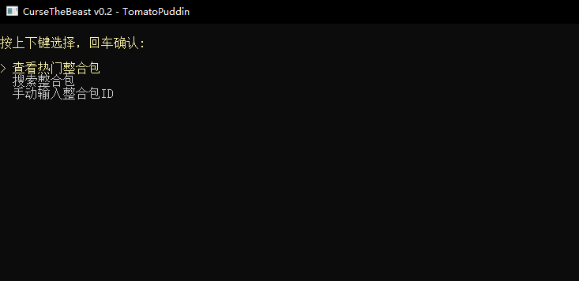
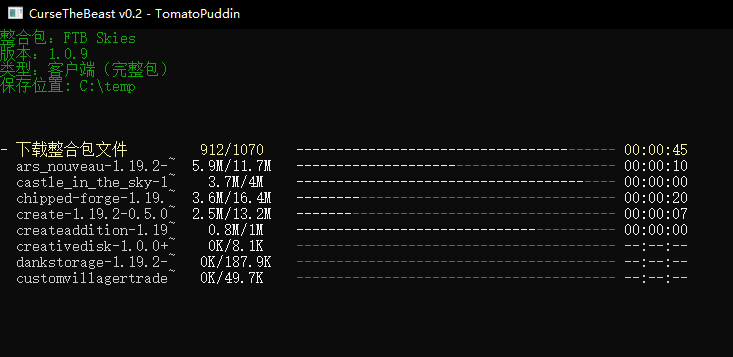
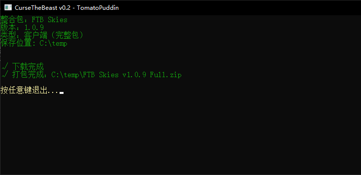
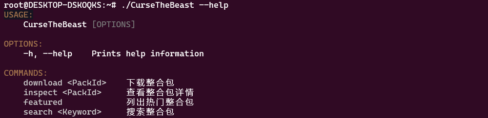
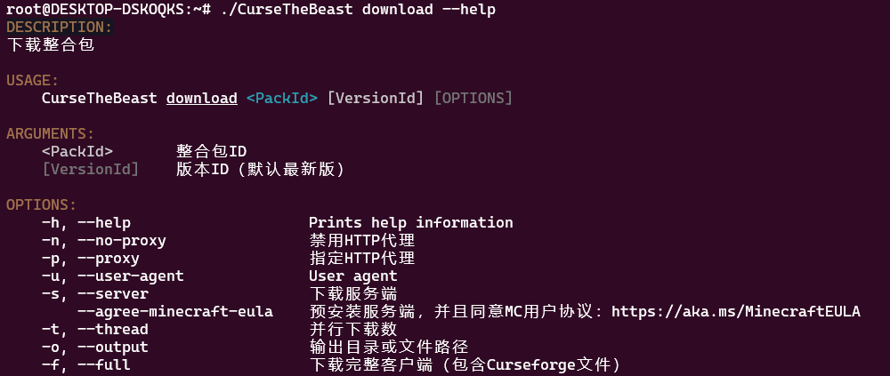
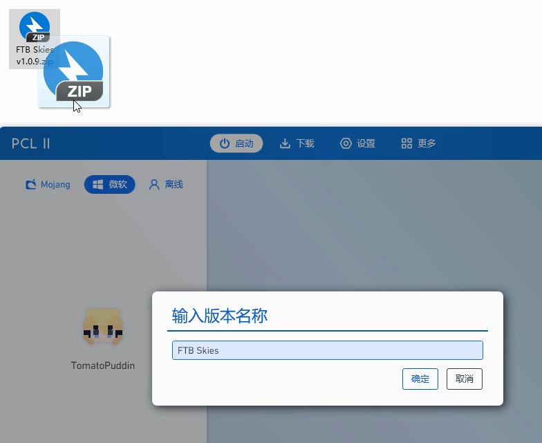

CurseTheBeast
==============

**This project is only for areas where FTB APP does not work well due to the network environment. Please do not propose i18n support.**

## 介绍
一款开源、轻量、跨平台的FTB整合包下载工具。有以下特性：

- 打包为Curseforge整合包格式，主流启动器都能导入安装。
- 支持下载安装服务端，方便开服。
- 自动检测系统代理和HTTP_PROXY环境变量，也可以通过命令行参数指定代理。
- 从多个镜像源下载依赖，比官方安装器更快。（检测到代理时不使用镜像源）

## 系统要求
### Windows
推荐 Windows 10 1607/LTSB 以上，并且启用新版控制台（默认就是启用的，只要别瞎折腾）。
  
不支持 Windows 7。

### Linux
仅支持基于 GNU libc 的发行版，要求系统已安装 ca-certificates 包。
  
无参启动需要确保终端支持 ANSI/VT100。如果在 Docker 容器中，还需要 run/exec 命令传入 -it 参数。

## 使用说明

两种使用方式，按个人喜好选择

- **双击打开，按照引导操作**

  
  
  
  
  

- **命令行**

  

  
  
## 整合包安装方法

把打包好的文件拖到启动器上即可安装

**注意根据MC版本选择正确的Java版本运行**
- 1.16以下用Java8运行（不考虑远古版本）
- 1.16.x用Java8或Java11运行（视具体情况而定）
- 1.17.x用Java16运行
- 1.18及更高版本用Java17运行

## 常见问题
- 如果报错“调用接口失败”，开启代理再试。如果确认代理有效却无法解决问题，请创建Issue反馈。
- 整合包文件非常多时，获取清单会很慢（如FTB Interactions）。开启代理即可解决。
- 偶尔会有文件下载失败，自动重试三次后报错崩溃。一般只要重开就能解决，开启代理更好。
- 服务端包含了一些客户端的文件？说明FTB官方没有把这些文件标记为ClientOnly，用官方下载器一样会下载到这些。（一般不影响使用）
- 有些Curseforge文件因某些原因失效而无法下载，需手动处理（即使打包成功）。请留意控制台输出的**红字信息**和包里的 **unreachable-files.json** 文件。
- 1.12.2之前的版本年久失修，本工具仅保证正确下载安装，其它问题需自行解决。
- 有些mod在主线程上检查更新，导致游戏启动非常慢。启动期间断开网络即可解决。

## 镜像源

| 名称     | 用途     |
| :------:  | :------ |
| [MCBBS](https://www.mcbbs.net/) | MC meta/jar/maven、Forge/Fabric/NeoForge maven |
| [BMCLAPI](https://bmclapidoc.bangbang93.com/) | MC meta/jar/maven、Forge/Fabric/NeoForge maven |
| [LSS233](https://www.mcbbs.net/forum.php?mod=viewthread&tid=800729) | MC/Forge/Fabric maven |

## 缓存

缓存能加速程序运行，但时间久了会占用大量存储空间，可以定期手动清理。

windows下缓存位置为
`%LOCALAPPDATA%\CurseTheBeast`

linux下为
`~/.local/share/CurseTheBeast`

## 其它

默认UA
`CurseTheBeast/0.0`
